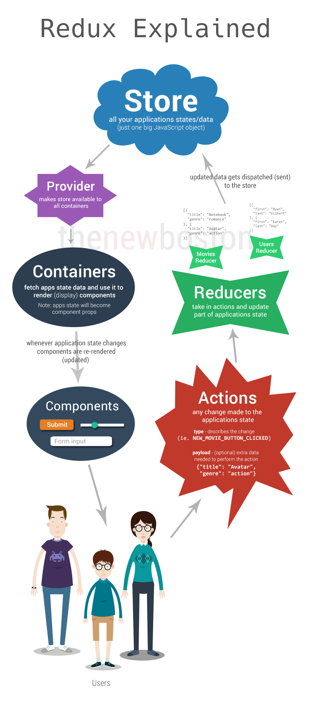
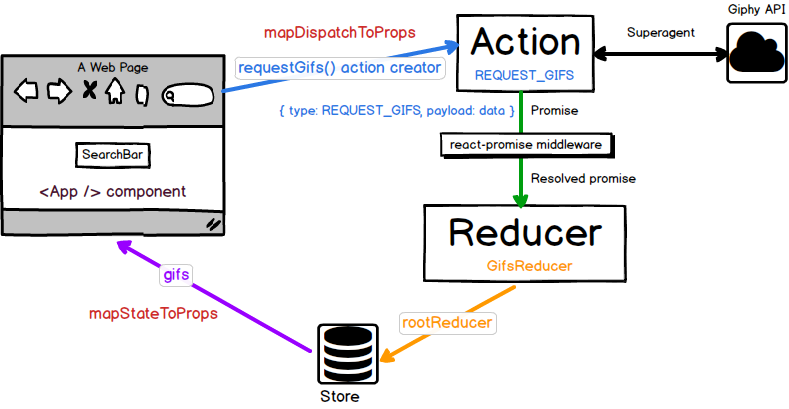

# react-redux-exercise
Exercise to understand better react-redux, how it works and how to use it.

**If you like this repo and/or learnt something from it, please give us a star :) Thanks!**

## Get started

### Prerequisites

This project uses [nvm](https://github.com/creationix/nvm). 

You need to have it installed on your machine.

### Install

To install our dependencies:

```sh
$ git clone https://github.com/springload/react-redux-exercise.git

$ cd react-redux-exercise

# Install the correct version of Node/NPM with nvm
$ nvm install

# Then, install all project dependencies.
$ npm install

# Then run the server
$ npm run start

# Open your browser to http://localhost:3000
```

And if you want some `eslint` love (and you should):

`npm run lint .` (or specify the path to the file you want to check)

## Redux

### with images



Source https://www.reddit.com/r/webdev/comments/4r1947/i_am_working_on_a_reactredux_video_tutorial/


Source http://staltz.com/unidirectional-user-interface-architectures.html



Source http://blog.tighten.co/react-101-using-redux


### with words

Don't be afraid by these images if you find them complicated.
Redux just needs to be tested and you will pick it up.

Basically, a Redux cycle works like this:
- A user clicks on a button on the UI (for instance)
- This button dispatches an action
- This action will be managed by a reducer which is listening for one or many actions
- This reducer will update the store state
- The new store is then passed to the component which rerenders with the new value
